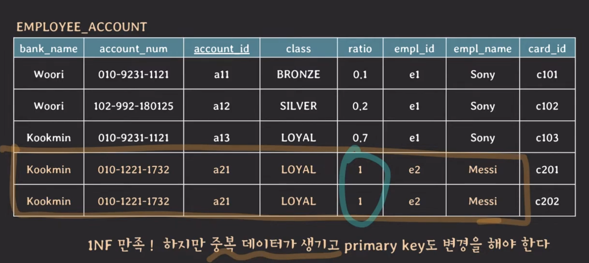
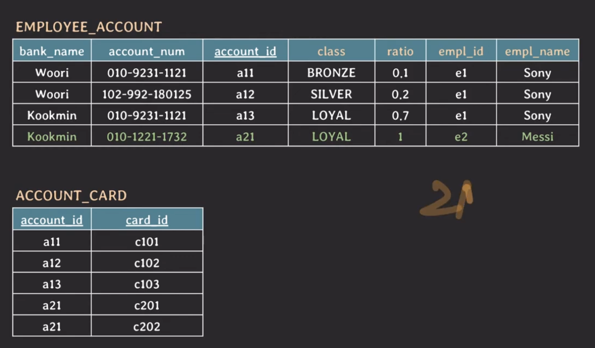

# lecture23 - db 정규화 (1NF, 2NF)

## DB 정규화

데이터 중복과 삽입, 갱신, 삭제 이상을 최소화하기 위해 일련의 normal formms에 따라 관계형 DB를 수정하는 과정이다.

## 예시

- bank_name
- account_num
- account_id
- class
- ratio
- empl_id
- empl_name
- card_id

- super key: table에서 tuple들을 unique하게 식별할 수 있는 attributes set
- (candidate) key: 어느 한 attribute라도 제거하면 unique하게 tuples를 식별할 수 없는 super key
  - { account_id }, { bank_name, account_num }
- primary key: table에서 tuple들을 unique하게 식별하려고 선택된 candidate) key
  - { account_id }
- prime attribute: 임의의 key에 속하는 attribute
  - account_id, bank_name, account_num
- non-prime attribute: 어떠한 key에도 속하지 않는 attribute
  - class, ratio, empl_id, empl_name, card_id

## 1NF

**attribute의 값은 반드시 나눠질 수 없는 단일한 값이어야 한다.**

그러나 중복 데이터가 있고 PK도 변경해야 한다.

(candidate) key: { account_id, card_id }, { bank_name, account_num, card_id }
non-prime attribute: class, ratio, empl_id, empl_name

현재 상황에서 `{ account_id, card_id } -> { class, ratio, empl_id, empl_name }` FD가 있다.

그런데 `{ account_id } -> { class, ratio, empl_id, empl_name }` FD도 가능하다.

즉 모든 `non-prime attribute` 들이 `{ account_id, card_id }` 에 `partially dependent` 하다.

또한 `{ bank_name, account_num, card_id }` 에도 `partially dependent` 하다.

## 2NF

**모든 non-prime attribute는 모든 key에 fully functionally dependent 해야 한다.**

이제 `card_id` 를 분리해야 한다.

